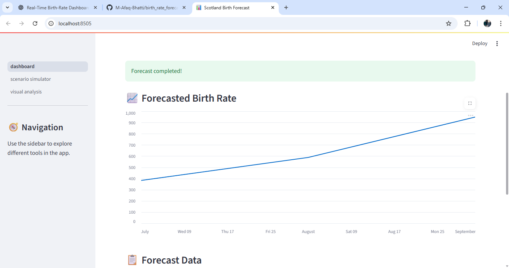

# 📊 Real-Time Birth Rate Forecasting Dashboard for Scotland

A machine learning-powered dashboard that provides **real-time forecasting** of birth rates across Scottish regions. Built using **XGBoost** for predictive modeling and **Streamlit** for an interactive user interface, the system supports automated weekly retraining to keep forecasts fresh and reliable.

---

## 🚀 Features

- ✅ Clean & modular ML pipeline (data ingestion → preprocessing → modeling → forecasting)
- 📈 Real-time interactive dashboard with region-wise forecasts
- 🧠 Machine Learning model powered by XGBoost
- 🔁 Automated model retraining with scheduler support
- 🗃️ Easily extendable for other time-series use cases
- 💡 Beginner-friendly architecture and codebase

---


---

## ⚙️ Installation

> 💡 Recommended: Use a virtual environment (e.g., `venv`, `conda`)

```bash
# Clone the repository
git clone https://github.com/your-username/birth-rate-forecasting-dashboard.git
cd birth-rate-forecasting-dashboard

# Install dependencies
pip install -r requirements.txt
```

---
## 🧪 Running the Dashboard

```bash
# Navigate to app folder and run the dashboard
cd app
streamlit run dashboard.py
```

---
## 🔁 Enable Weekly Retraining 

```bash
# Run manually (or set as a weekly CRON job)
python scheduler/retrain_model.py
```
---

## 📊 Sample Dashboard Preview

---

## Model Details
Algorithm: XGBoost Regressor

**Features**:
- Lag values of previous 3 months
- Month/Year time features
- One-hot encoded area values

**Scaler**: StandardScaler from Scikit-learn

**Evaluation**:
- MAE: ~69
- R² Score: 0.837

---
## Data Source
This project uses public monthly birth statistics from:

- General Register Office for Scotland

- Ensure any CSV data is placed in the expected format within the data/ folder.
